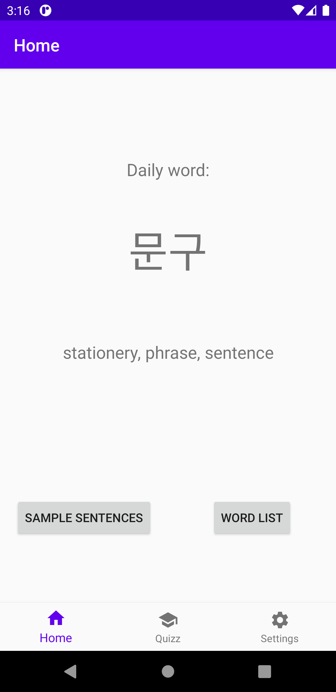
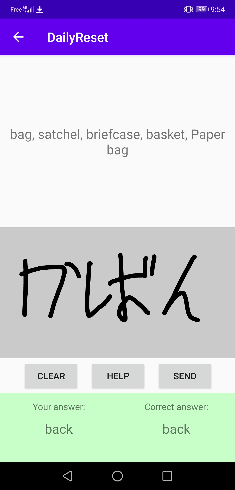
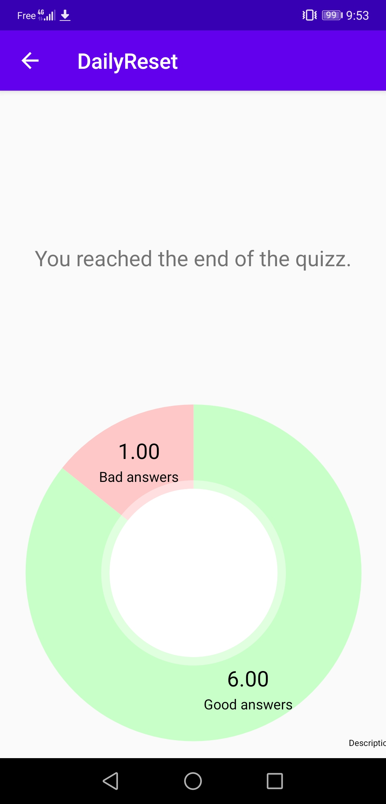
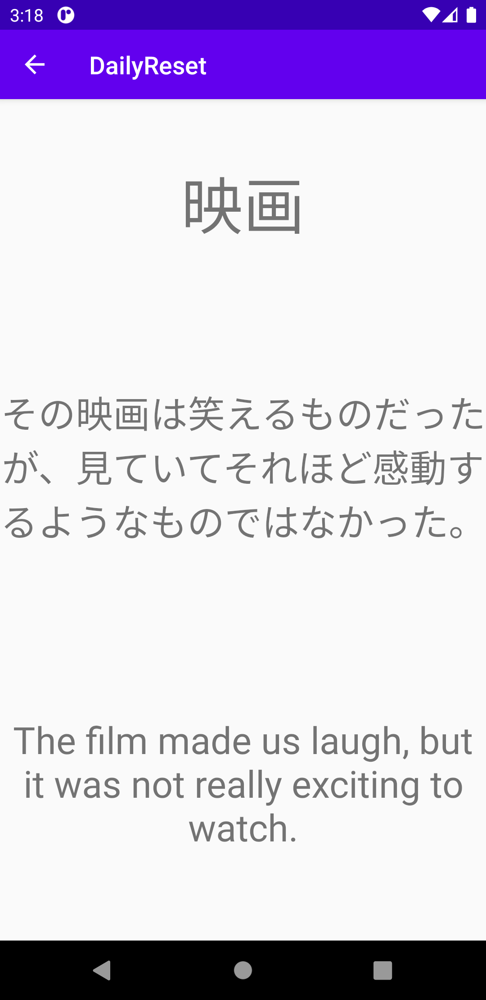

# DailyReset
DailyReset is an application to help you learning a new language. 
The application will give you a word everyday, do you best to memorize them and test your knowledge with a quizz.

|  |  |  |  |
| -------------------------------------- | --------------------------------------- | ---------------------------------------- | ------------------------------------------ |
| Main page                              | Quizz                                   | Quizz result                             | Sample sentences                           |

Preview images may not be from the latest version of the app

## Dictionnaries used
**Japanese dictionary** is an API dump of [Jisho](https://jisho.org) 
**Korean dictionary** is an export of a [Korean vocabulary card from Anki](https://ankiweb.net/shared/info/4066961604)

Sentences are from [Tatoeba database](https://tatoeba.org/en/downloads)
